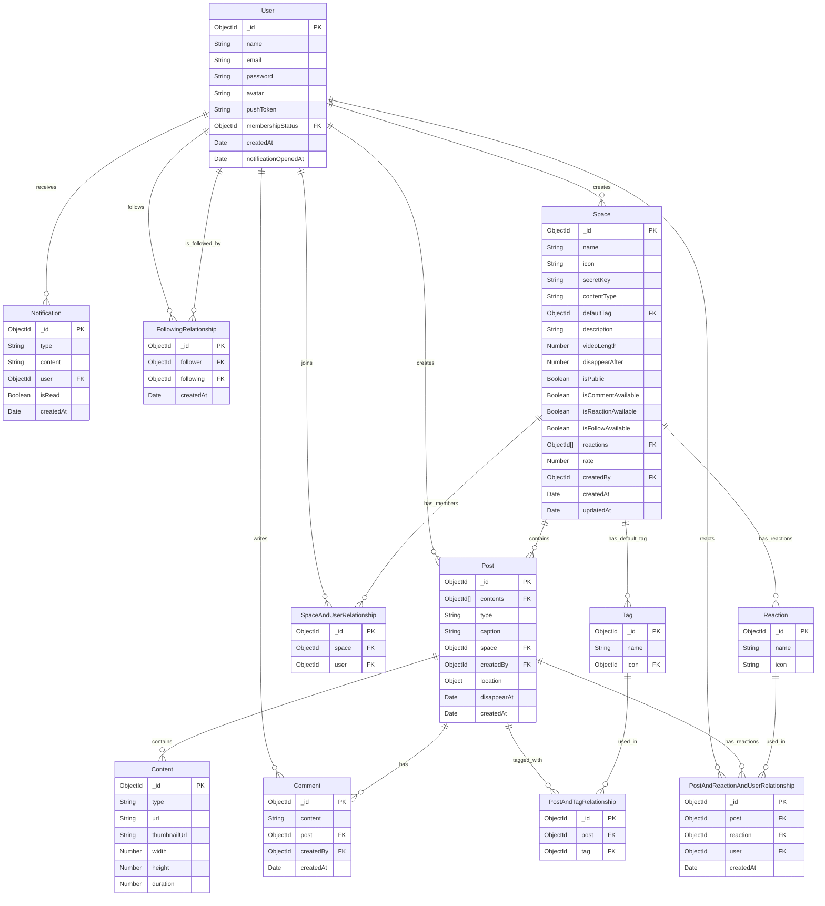

# データベース設計

## ER 図

## テーブル一覧

### User

ユーザー情報を管理するテーブル

| カラム名             | 型       | 説明                        | 制約                   |
| -------------------- | -------- | --------------------------- | ---------------------- |
| \_id                 | ObjectId | ユーザー ID                 | Primary Key            |
| name                 | String   | ユーザー名                  | Required               |
| email                | String   | メールアドレス              | Required, Unique       |
| password             | String   | パスワード                  | Required, Min 10 chars |
| avatar               | String   | アバター画像 URL            | -                      |
| pushToken            | String   | プッシュ通知用トークン      | -                      |
| membershipStatus     | ObjectId | メンバーシップステータス ID | Foreign Key            |
| createdAt            | Date     | 作成日時                    | Default: Current Time  |
| notificationOpenedAt | Date     | 通知を最後に開いた日時      | Default: null          |

### Post

投稿を管理するテーブル

| カラム名             | 型         | 説明                 | 制約                       |
| -------------------- | ---------- | -------------------- | -------------------------- |
| \_id                 | ObjectId   | 投稿 ID              | Primary Key                |
| contents             | [ObjectId] | コンテンツ ID の配列 | Foreign Key                |
| type                 | String     | 投稿タイプ           | Enum: ['normal', 'moment'] |
| caption              | String     | キャプション         | -                          |
| space                | ObjectId   | スペース ID          | Foreign Key                |
| createdBy            | ObjectId   | 作成者 ID            | Foreign Key                |
| location             | Object     | 位置情報             | -                          |
| location.type        | String     | 位置情報タイプ       | Default: 'Point'           |
| location.coordinates | [Number]   | 座標                 | -                          |
| disappearAt          | Date       | 消失日時             | -                          |
| createdAt            | Date       | 作成日時             | -                          |

### Space

スペース（コミュニティ）を管理するテーブル

| カラム名            | 型         | 説明                   | 制約                                      |
| ------------------- | ---------- | ---------------------- | ----------------------------------------- |
| \_id                | ObjectId   | スペース ID            | Primary Key                               |
| name                | String     | スペース名             | -                                         |
| icon                | String     | アイコン画像 URL       | -                                         |
| secretKey           | String     | シークレットキー       | -                                         |
| contentType         | String     | コンテンツタイプ       | Enum: ['photo', 'video', 'photoAndVideo'] |
| defaultTag          | ObjectId   | デフォルトタグ ID      | Foreign Key                               |
| description         | String     | 説明                   | -                                         |
| videoLength         | Number     | 動画の長さ             | -                                         |
| disappearAfter      | Number     | 消失までの時間（分）   | -                                         |
| isPublic            | Boolean    | 公開フラグ             | Required                                  |
| isCommentAvailable  | Boolean    | コメント許可フラグ     | Required                                  |
| isReactionAvailable | Boolean    | リアクション許可フラグ | Required                                  |
| isFollowAvailable   | Boolean    | フォロー許可フラグ     | Required                                  |
| reactions           | [ObjectId] | リアクション ID の配列 | Foreign Key                               |
| rate                | Number     | レート                 | -                                         |
| createdBy           | ObjectId   | 作成者 ID              | Foreign Key                               |
| createdAt           | Date       | 作成日時               | -                                         |
| updatedAt           | Date       | 更新日時               | -                                         |

### Content

投稿のコンテンツを管理するテーブル

| カラム名     | 型       | 説明             | 制約        |
| ------------ | -------- | ---------------- | ----------- |
| \_id         | ObjectId | コンテンツ ID    | Primary Key |
| type         | String   | コンテンツタイプ | -           |
| url          | String   | コンテンツ URL   | -           |
| thumbnailUrl | String   | サムネイル URL   | -           |
| width        | Number   | 幅               | -           |
| height       | Number   | 高さ             | -           |
| duration     | Number   | 動画の長さ       | -           |

### Tag

タグを管理するテーブル

| カラム名 | 型       | 説明        | 制約        |
| -------- | -------- | ----------- | ----------- |
| \_id     | ObjectId | タグ ID     | Primary Key |
| name     | String   | タグ名      | -           |
| icon     | ObjectId | アイコン ID | Foreign Key |

### Reaction

リアクションを管理するテーブル

| カラム名 | 型       | 説明            | 制約        |
| -------- | -------- | --------------- | ----------- |
| \_id     | ObjectId | リアクション ID | Primary Key |
| name     | String   | リアクション名  | -           |
| icon     | String   | アイコン URL    | -           |

### Comment

コメントを管理するテーブル

| カラム名  | 型       | 説明         | 制約        |
| --------- | -------- | ------------ | ----------- |
| \_id      | ObjectId | コメント ID  | Primary Key |
| content   | String   | コメント内容 | -           |
| post      | ObjectId | 投稿 ID      | Foreign Key |
| createdBy | ObjectId | 作成者 ID    | Foreign Key |
| createdAt | Date     | 作成日時     | -           |

### Notification

通知を管理するテーブル

| カラム名  | 型       | 説明        | 制約        |
| --------- | -------- | ----------- | ----------- |
| \_id      | ObjectId | 通知 ID     | Primary Key |
| type      | String   | 通知タイプ  | -           |
| content   | String   | 通知内容    | -           |
| user      | ObjectId | ユーザー ID | Foreign Key |
| isRead    | Boolean  | 既読フラグ  | -           |
| createdAt | Date     | 作成日時    | -           |

## リレーションシップ

### PostAndTagRelationship

投稿とタグの関連付けを管理するテーブル

| カラム名 | 型       | 説明    | 制約        |
| -------- | -------- | ------- | ----------- |
| \_id     | ObjectId | ID      | Primary Key |
| post     | ObjectId | 投稿 ID | Foreign Key |
| tag      | ObjectId | タグ ID | Foreign Key |

### SpaceAndUserRelationship

スペースとユーザーの関連付けを管理するテーブル

| カラム名 | 型       | 説明        | 制約        |
| -------- | -------- | ----------- | ----------- |
| \_id     | ObjectId | ID          | Primary Key |
| space    | ObjectId | スペース ID | Foreign Key |
| user     | ObjectId | ユーザー ID | Foreign Key |

### FollowingRelationship

フォロー関係を管理するテーブル

| カラム名  | 型       | 説明          | 制約        |
| --------- | -------- | ------------- | ----------- |
| \_id      | ObjectId | ID            | Primary Key |
| follower  | ObjectId | フォロワー ID | Foreign Key |
| following | ObjectId | フォロー中 ID | Foreign Key |
| createdAt | Date     | 作成日時      | -           |

### PostAndReactionAndUserRelationship

投稿、リアクション、ユーザーの関連付けを管理するテーブル

| カラム名  | 型       | 説明            | 制約        |
| --------- | -------- | --------------- | ----------- |
| \_id      | ObjectId | ID              | Primary Key |
| post      | ObjectId | 投稿 ID         | Foreign Key |
| reaction  | ObjectId | リアクション ID | Foreign Key |
| user      | ObjectId | ユーザー ID     | Foreign Key |
| createdAt | Date     | 作成日時        | -           |
